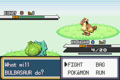
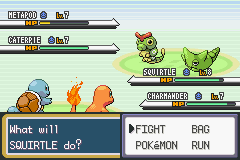

# [EternalCode](https://github.com/EternalCode)'s BW Style Health Bars and Box for Pokémon Fire Red

*Note: I, [PlatinumMaster](https://github.com/PlatinumMaster), am not the original creator of this. That would be [EternalCode](https://github.com/EternalCode). I just fixed the build and insertion scripts as they were busted.*

**This is to be used on a binary Pokémon FireRed ROM.**

## Instructions to build:
* Ensure you have a working [devkitARM](https://devkitpro.org/wiki/Getting_Started) and [Python 3](https://www.python.org/downloads/) setup.
* Place a vanilla Pokémon FireRed ROM, with the title `BPRE0.gba`, in the root directory.
* Using command prompt, run:

### If you're on Windows and using Command Prompt:
> python scripts\build && python scripts\insert

### If you're on Windows and using PowerShell:
> python scripts\build; python scripts\insert

### If you're on Linux:
> python scripts/build && python scripts/insert

* You should now see a ROM with the title `test.gba`. Run that in an emulator, and see your changes.

## Screenshots
Single battle:

Double battles:

